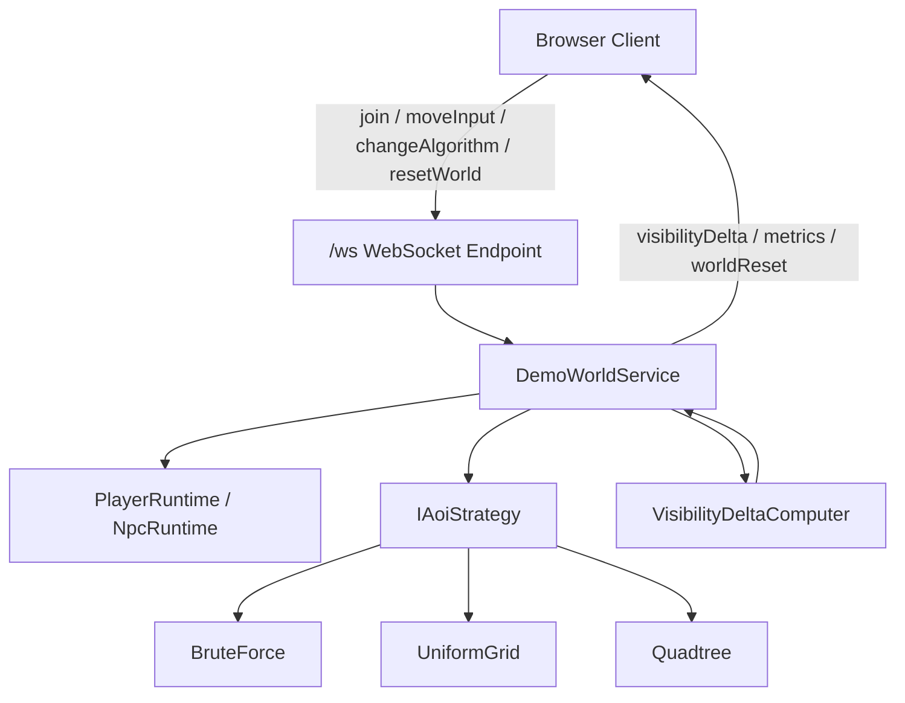
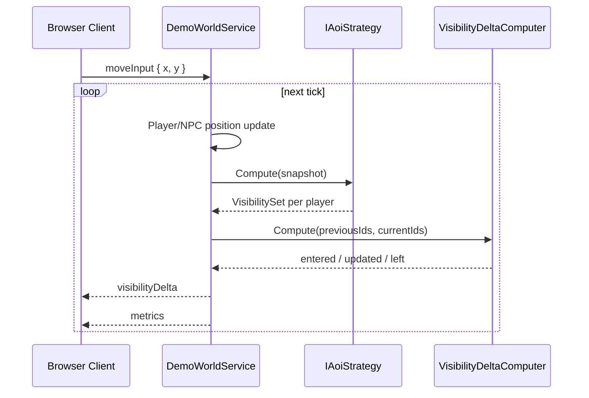

# AOI (Area of Interest) Demo

> C# raw WebSocket 서버와 HTML5 Canvas 클라이언트로 MMORPG의 AOI 동작을 시각화하고, Brute Force / Uniform Grid / Quadtree 알고리즘을 비교할 수 있게 만든 데모 프로젝트

[](https://youtu.be/Bz5V8e3XhCo?t=0s)
_AOI 알고리즘과 상태, 서버 메트릭스를 확인할 수 있는 데모 영상_

온라인 게임 서버에서 AOI(Area of Interest)는 네트워크 비용과 서버 연산 비용을 동시에 제어하는 핵심 장치이다.  
플레이어 주변에 실제로 필요한 엔티티만 보내지 않으면, 월드 상태가 조금만 커져도 전송량과 거리 계산 비용이 빠르게 폭증한다.  
문제는 이 개념이 설명으로는 익숙해도, 실제 서버 루프와 메시지 모델 안에서 어떻게 작동하는지는 쉽게 보이지 않는다는 점이다.

이 프로젝트는 AOI를 통해 네트워크 비용과 서버 연산 비용을 어떻게 줄일 수 있는지 눈으로 확인하기 위해 만들었다. 서버는 `ASP.NET Core + raw WebSocket`으로 동작하고, 클라이언트는 `HTML5 Canvas`로 렌더링한다. 각 브라우저 탭은 하나의 플레이어처럼 동작하며, 클라이언트는 자신의 AOI 반경 안에 들어온 `PC/NPC` 정보만 받는다. 동시에 `Brute Force`, `Uniform Grid`, `Quadtree` 세 가지 알고리즘을 같은 월드 루프에서 교체 가능하게 두어, 정확도는 유지하면서 후보를 줄이는 방식이 어떻게 달라지는지 비교할 수 있게 했다.

## AOI가 필요한 이유

MMORPG 서버는 전체 월드를 모든 클라이언트에 그대로 보낼 수 없다.  
플레이어가 실제로 상호작용할 가능성이 있는 대상은 대개 자신 주변의 작은 영역에 한정되기 때문이다.

전체 월드 브로드캐스트를 계속 밀어붙이면 다음 문제가 곧바로 생긴다.

- 플레이어 수와 NPC 수가 늘수록 네트워크 전송량이 기하급수적으로 커진다.
- 각 플레이어 시점에서 누가 보여야 하는지 계산하는 비용이 서버 틱 시간에 직접 반영된다.
- 디버깅이 어려워진다. “왜 이 클라이언트가 이 엔티티를 받고 있는가”를 눈으로 확인하기 어렵다.

AOI는 이 문제를 해결하는 가장 직접적인 경계이다.  
서버는 플레이어 시점에서 관심 반경 안에 들어온 엔티티만 골라 보내고, 클라이언트는 그 결과만 렌더링한다. 이 프로젝트의 핵심은 이 과정을 숨기지 않고 전면에 드러내는 데 있다.

## 이 데모가 실제로 보여주는 것

스크린샷 기준으로 한 화면에는 네 가지 레이어가 동시에 있다.

- 상단 HUD: 연결 상태, 플레이어 이름, 현재 visible entity 수, 선택한 AOI 알고리즘(변경 가능)
- 중앙 월드 뷰: 플레이어 본체, AOI 원, 반경 안에 들어온 NPC/PC 라벨, 디버그 오버레이
- 하단 메트릭 패널: `Entities`, `Visible`, `Distance Checks`, `Queries`, `Index Build (ms)`, `Query (ms)`, `Messages`, `Bytes`

데모 사용 흐름은 다음과 같다.

1. 브라우저 탭 또는 창을 두 개 이상 연다.
2. 각각 서버(`localhost:8080`)에 접속한다.
3. 한 플레이어를 움직이면 다른 플레이어가 AOI 반경 안에 들어오거나 나간다.
4. 그 순간 `visibilityDelta` 메시지가 바뀌고, visible entity 수와 metrics도 함께 변한다.
5. 알고리즘을 바꾸면 동일한 월드를 다시 초기화한 뒤 다른 공간 인덱싱 방식으로 문제를 해결하는 것을 눈으로 확인할 수 있다.

이 데모를 통해 **AOI가 서버 루프 안에서 어떤 데이터 흐름을 만든다**는 것을 확인할 수 있다.

## 구현 내용

- `ASP.NET Core` 단일 호스트 안에서 정적 UI와 WebSocket 서버를 함께 제공한다.
- 서버 authoritative tick loop가 플레이어 입력과 NPC 이동을 일관되게 처리한다.
- `IAoiStrategy` 경계 뒤에 세 가지 AOI 알고리즘을 교체 가능하게 분리했다.
- `entered / updated / left` 기반 visibility delta 모델로 전체 상태 대신 변경분만 전송한다.
- Canvas와 오버레이, 메트릭 차트로 AOI 내부 동작을 외부에서 관찰 가능하게 만들었다.

## 시스템 구성 개요

- `Program.cs`: ASP.NET Core 호스트 구성, WebSocket 엔드포인트 `/ws`, 정적 파일 제공
- `DemoWorldService`: 연결 수명주기, 플레이어/NPC 상태, 월드 틱, AOI 계산, 메시지 전송
- `IAoiStrategy` 및 구현체: 플레이어별 visible set 계산
- `VisibilityDeltaComputer`: 이전 가시 집합과 현재 가시 집합의 차이 계산
- `app.js`: WebSocket 클라이언트, 입력 처리, Canvas 렌더링, metrics 패널 갱신



## 서버 런타임 상세

### 1. authoritative tick loop

서버는 `BackgroundService` 기반으로 `20 TPS` 고정 틱 루프를 돈다.  
클라이언트는 좌표를 직접 결정하지 않고 `moveInput`만 보낸다. 실제 위치 갱신은 다음 틱에서 서버가 수행한다.

기본 월드 설정은 다음과 같다.

| 항목 | 값 |
| --- | --- |
| World Width | `2400` |
| World Height | `1800` |
| Tick Rate | `20 TPS` |
| AOI Radius | `260` |
| NPC Count | `200` |
| Player Speed | `300` |
| NPC Speed | `120` |
| Seed | `424242` |
| Quadtree MaxDepth | `6` |
| Quadtree Capacity | `6` |

이 설정은 `WorldOptions`로 묶여 있고, 알고리즘 구현과 런타임 서비스가 같은 설정을 공유한다.

### 2. 입력 반영 방식

클라이언트는 `WASD` 또는 방향키 입력을 정규화한 벡터로 서버에 전송한다.  
서버는 그 입력을 `PlayerRuntime`에 저장하고, 틱 루프에서 `deltaSeconds`와 `PlayerSpeed`를 곱해 위치를 갱신한다.

- 클라이언트는 입력만 보내므로 authoritative boundary가 확실하다.
- visible set 계산은 항상 서버 기준 위치로 수행된다.
- 다중 탭 상황에서도 “누가 누구를 볼 수 있는가”가 한 기준으로 정렬된다.

### 3. visibility delta 생성

한 틱의 핵심 흐름은 다음과 같다.

1. 플레이어와 NPC 위치를 갱신한다.
2. 현재 월드 스냅샷을 만든다.
3. 선택된 `IAoiStrategy`로 플레이어별 visible set을 계산한다.
4. 이전 틱의 visible set과 비교해 `entered`, `updated`, `left`를 만든다.
5. 각 클라이언트에 `visibilityDelta`와 `metrics`를 전송한다.



**전체 visible set을 매번 통째로 보내지 않는다.** 현재 구현은 `entered`, `updated`, `left`로 증분을 만들고, 클라이언트는 로컬 맵을 갱신하는 방식으로 화면을 유지한다.

## AOI 알고리즘 비교

이 프로젝트는 세 알고리즘 모두 **최종적으로는 같은 visible set을 만들도록** 설계되어 있다. 차이는 후보를 어떻게 줄이고, 그 과정에서 어떤 비용을 치르느냐에 있다.

| 항목 | Brute Force | Uniform Grid | Quadtree |
| --- | --- | --- | --- |
| 범위 | 모든 엔티티를 직접 거리 검사 | 엔티티를 셀로 묶고 주변 셀만 검사 | 공간 분할 트리에서 쿼리 영역만 탐색 |
| 인덱스 구축 비용 | 없음 | 셀 맵 생성 | 트리 생성 |
| query 비용 | 가장 큼 | 중간 | 상황에 따라 가장 작을 수 있음 |
| 구현 난이도 | 가장 낮음 | 중간 | 가장 높음 |
| 디버그 오버레이 | 없음 | 격자 오버레이 | 트리 경계 오버레이 |
| 의미 | 정확도 기준선 | 균형 잡힌 기본 전략 | 확장형 공간 분할 전략 |

### Brute Force

가장 단순하다. 각 플레이어마다 모든 엔티티를 순회하면서 AOI 반경 안에 있는지 직접 검사한다. 인덱스를 만들 필요가 없어 구현이 명확하고, 다른 알고리즘을 검증하는 기준선으로 쓰기 좋다. 대신 `distanceChecks`가 가장 빠르게 늘어난다.

### Uniform Grid

비교적 균형이 잡혀있는 알고리즘이다. 셀 크기를 `AOI radius`와 동일하게 두고, 플레이어 중심 AOI 원을 덮는 셀 범위만 조회한다. 그 뒤 최종 거리 계산으로 정확도를 맞춘다. 이 방식은 구조가 단순하면서도, `Brute Force`보다 명확하게 후보 수를 줄인다.

### Quadtree

루트 노드를 전체 월드 크기로 두고, `capacity`와 `maxDepth` 기준으로 공간을 분할한다. 플레이어 AOI 원 자체를 직접 탐색하는 대신, AOI를 감싸는 사각형으로 후보를 수집한 뒤 최종 거리 계산을 한다. 불균일 분포를 설명하는 데는 강하지만, 자료구조와 재구성 비용을 함께 이해해야 하므로 복잡도는 가장 높다.

## 메시지와 데이터 모델

### 클라이언트 → 서버 메시지

| 메시지 | 의미 |
| --- | --- |
| `join` | 플레이어 이름을 보내고 월드에 참가한다. |
| `moveInput` | 현재 입력 방향 벡터를 서버에 보낸다. |
| `changeAlgorithm` | AOI 전략을 전역적으로 교체한다. |
| `resetWorld` | 현재 알고리즘을 유지한 채 월드를 리셋한다. |
| `ping` | 연결 유지나 테스트 용도의 단순 메시지다. |

### 서버 → 클라이언트 메시지

| 메시지 | 의미 |
| --- | --- |
| `welcome` | 플레이어 id, 초기 self 상태, 월드 설정, 현재 알고리즘을 보낸다. |
| `worldReset` | 월드 버전, seed, 알고리즘, self 상태를 다시 보낸다. |
| `visibilityDelta` | `entered`, `updated`, `left` 변경분과 현재 self 위치를 보낸다. |
| `metrics` | 현재 틱의 알고리즘 비용과 메시지 전송량을 보낸다. |
| `error` | join 전 입력, 잘못된 메시지 등 오류 상황을 알려준다. |

### 주요 타입

#### `WorldOptions`

월드 크기, AOI 반경, 틱 속도, NPC 수, 속도, 난수 시드, 쿼드트리 설정을 묶는다. 이 타입 하나로 데모의 규모와 알고리즘 동작 조건이 정해진다.

#### `IAoiStrategy`

AOI 계산을 담당하는 인터페이스다. 월드 스냅샷을 받아 플레이어별 `VisibilitySet`, 거리 계산 수, 쿼리 수, 인덱스 구축 시간, 디버그 오버레이를 반환한다.

#### `AoiAlgorithm`

현재 알고리즘 선택 상태를 나타내는 열거형이다. 필요에 따라 추가로 알고리즘을 구현해서 비용을 확인할 수 있다.

- `BruteForce`
- `UniformGrid`
- `Quadtree`
- ...

#### `MetricsSnapshot`

AOI 알고리즘의 성능을 수치로 확인하기 위한 값이다.

| 필드 | 의미 |
| --- | --- |
| `entityCount` | 현재 월드에 존재하는 전체 엔티티 수 |
| `totalVisibleCount` | 플레이어 시점 visible entity의 총합 |
| `distanceChecks` | 최종 거리 계산 횟수 |
| `queryCount` | 플레이어별 조회 수행 횟수 |
| `indexBuildMs` | 인덱스 구축 비용 |
| `queryMs` | 실제 조회 비용 |
| `messageCount` | 해당 틱에 전송한 메시지 수 |
| `bytesSent` | 해당 틱에 전송한 바이트 수 |

## 메트릭과 디버그 시각화

알고리즘이 바뀌었을 때 무엇이 달라지는지 확인하기 위해 웹으로 접속해서 확인할 수 있도록 했다.


데모를 통해 다음 내용을 확인할 수 있다.

- 지금 월드 크기에서 visible entity가 얼마나 되는가
- 어떤 전략이 거리 계산 횟수를 더 줄이는가
- 인덱스를 만드는 비용이 query 절감보다 큰가 작은가
- 알고리즘 전환 직후 메시지 수와 바이트 수는 어떻게 바뀌는가
- Debug
    - `Uniform Grid`: 어떤 셀 범위를 스캔하는지 직접 보여준다.
    - `Quadtree`: 노드 분할 경계가 어떻게 생겼는지 보이게 만든다.

## 실행 방법

### 요구 사항

- .NET SDK 10
- 최신 브라우저(Chrome, Edge, Safari 등)

### 실행

```bash
dotnet run --project src/AoiDemo.Web/AoiDemo.Web.csproj
```

서버가 올라오면 브라우저에서 다음 주소로 접속한다.

```text
http://localhost:8080
```

개발 환경이나 launch settings에 따라 포트가 다를 수 있다.  
실행 로그에 표시되는 주소를 기준으로 접속하면 된다.

### 조작

- 이동: `WASD` 또는 방향키
- 알고리즘 전환: 상단 `Algorithm` 선택
- 월드 리셋: `RESET` 버튼
- 디버그 오버레이: `Debug` 토글

### 추천 데모 시나리오

1. 브라우저 탭 2~3개를 연다.
2. 한 탭에서 이동해 다른 플레이어가 AOI 안으로 들어오게 만든다.
3. visible entity 수와 metrics 변화를 확인한다.
4. 알고리즘을 `Brute Force → Uniform Grid → Quadtree` 순으로 바꿔 비교한다.

## 현재 구조의 한계

이 프로젝트는 실제 MMO 서버에 적용하기 위해서는 추가로 구현해야 될 부분이 많이 생략된 상태이다.

### 현재 한계

- `Uniform Grid`와 `Quadtree` 모두 매 틱 전체 인덱스를 재구축한다.
- 메시지 포맷이 JSON이므로 binary protocol보다 전송 효율이 낮다.
- 멀티 존, 셀 서버 분리, 영속성, 인증, 채팅, 전투 같은 실제 MMO 관심사는 범위 밖이다.
- 현재 연결 수명주기에는 새로고침 같은 순간적인 연결 교체에서 race 가능성이 남아 있다.
  - 예: 진행 중 송신과 연결 dispose가 충돌하면 `ObjectDisposedException`이 날 수 있다.

## 마무리

`Brute Force`, `Uniform Grid`, `Quadtree`를 같은 월드 루프에서 비교 가능하게 두었고, 메트릭과 오버레이로 그 차이를 외부에서 읽을 수 있게 만들었다. 데모를 통해 AOI가 어떻게 동작하는지 어떤 차이가 있는지 확인하기 위한 프로젝트로 초기 목적을 달성하기 위해 노력했다. 이후 다른 알고리즘도 추가로 구현할 수 있도록 하겠다.
